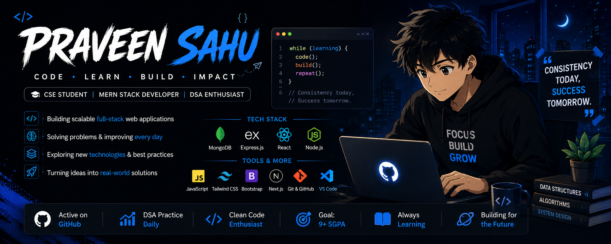

  

  

<h1 align="center">👋 Hi, I'm Praveen Sahu</h1>

<h3 align="center">
💻 B.Tech CSE Student | MERN Stack Developer
</h3>

---

## 👨‍💻 About Me

- 🎓 Computer Science Engineering Student
- 💻 Interested in Full-Stack Web Development
- 🌐 Working with the MERN Stack
- 🧠 Practicing Data Structures & Algorithms
- 🚀 Building real-world projects
- 🌱 Always learning and improving

---

---

## 🛠️ Tech Stack

### Languages

### MERN Stack

### Tools

---

## 🚀 Featured Projects

<table>
<tr>

<td width="50%" align="center">

### 🛒 Frontend projects

A full-stack applications built with modern web technologies.

**Tech:** MERN Stack

 

  
</a>

</td>

<td width="50%" align="center">

### 🎌 Anime Website

An anime-themed web project focused on frontend design and user experience.

**Tech:** HTML • CSS • JavaScript / MERN

 

  
</a>

</td>

</tr>

<tr>

<td width="50%" align="center">

### 📇 Contact Book

A contact management application with database integration.

**Tech:** JavaScript • MongoDB

 

</td>

<td width="50%" align="center">

### 🌐 Portfolio

My personal portfolio website showcasing my skills and projects.

**Tech:** HTML • CSS • JavaScript

 

</td>

</tr>
</table>

---

## 📊 GitHub Stats

  

---

## 🐍 Contribution Snake

<picture>
  <source
    media="(prefers-color-scheme: dark)"
    srcset="https://raw.githubusercontent.com/praveen5925/praveen5925/output/github-snake-dark.svg"
  />

  <source
    media="(prefers-color-scheme: light)"
    srcset="https://raw.githubusercontent.com/praveen5925/praveen5925/output/github-snake.svg"
  />

  
</picture>

---

## 🏆 GitHub Trophies

---

### 🚀 Keep Learning. Keep Building.

